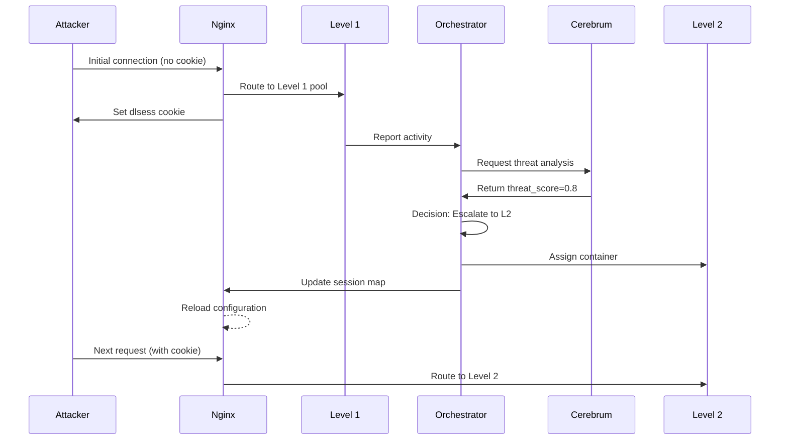

# 🏗 Dynamic Labyrinth Architecture

> Comprehensive architecture documentation for the Dynamic Labyrinth honeypot orchestration system.

---

## Table of Contents

1. [System Overview](#system-overview)
2. [High-Level Architecture](#high-level-architecture)
3. [Component Details](#component-details)
4. [Data Flow](#data-flow)
5. [Network Architecture](#network-architecture)
6. [Security Architecture](#security-architecture)
7. [Scalability & Performance](#scalability--performance)
8. [Technology Stack](#technology-stack)

---

## System Overview

Dynamic Labyrinth is a multi-tiered honeypot orchestration platform that:

1. **Captures** malicious traffic through decoy services
2. **Analyzes** attacker behavior using ML-based threat scoring
3. **Escalates** sophisticated threats to higher-fidelity environments
4. **Routes** sessions seamlessly using cookie-based affinity
5. **Collects** threat intelligence for analysis and response

### Design Principles

- **Defense in Depth**: Multiple honeypot tiers with increasing fidelity
- **Adaptive Response**: Dynamic escalation based on threat level
- **Session Continuity**: Seamless routing maintains attacker engagement
- **Operational Simplicity**: Container-based deployment with automated lifecycle
- **Observability**: Comprehensive logging, metrics, and tracing

---

## High-Level Architecture

```
┌─────────────────────────────────────────────────────────────────────────────────────────┐
│                                     INTERNET                                             │
│                           (Attackers, Scanners, Researchers)                             │
└─────────────────────────────────────────────────────────────────────────────────────────┘
                                          │
                                          ▼
┌─────────────────────────────────────────────────────────────────────────────────────────┐
│                                  EDGE LAYER                                              │
│  ┌─────────────────────────────────────────────────────────────────────────────────┐    │
│  │                           NGINX REVERSE PROXY                                    │    │
│  │  ┌───────────────┐  ┌───────────────┐  ┌───────────────┐  ┌───────────────┐     │    │
│  │  │ HTTP/HTTPS    │  │ Stream Proxy  │  │ Cookie Router │  │ Rate Limiter  │     │    │
│  │  │ (80/443)      │  │ (22,21,23...) │  │ (dlsess map)  │  │               │     │    │
│  │  └───────────────┘  └───────────────┘  └───────────────┘  └───────────────┘     │    │
│  └─────────────────────────────────────────────────────────────────────────────────┘    │
└─────────────────────────────────────────────────────────────────────────────────────────┘
                                          │
                    ┌─────────────────────┼─────────────────────┐
                    ▼                     ▼                     ▼
┌─────────────────────────────────────────────────────────────────────────────────────────┐
│                               HONEYPOT LAYER                                             │
│  ┌─────────────────────┐  ┌─────────────────────┐  ┌─────────────────────┐              │
│  │    LEVEL 1 POOL     │  │    LEVEL 2 POOL     │  │    LEVEL 3 POOL     │              │
│  │   (Low Fidelity)    │  │  (Medium Fidelity)  │  │   (High Fidelity)   │              │
│  │                     │  │                     │  │                     │              │
│  │  ┌─────┐ ┌─────┐   │  │  ┌─────┐ ┌─────┐   │  │      ┌─────┐        │              │
│  │  │ L1a │ │ L1b │   │  │  │ L2a │ │ L2b │   │  │      │ L3  │        │              │
│  │  └─────┘ └─────┘   │  │  └─────┘ └─────┘   │  │      └─────┘        │              │
│  │  ┌─────┐ ┌─────┐   │  │     ┌─────┐        │  │                     │              │
│  │  │ L1c │ │ L1d │   │  │     │ L2c │        │  │  • Full OS emulation│              │
│  │  └─────┘ └─────┘   │  │     └─────┘        │  │  • All protocols    │              │
│  │     ┌─────┐        │  │                     │  │  • File system      │              │
│  │     │ L1e │        │  │  • More protocols   │  │  • Process tracking │              │
│  │     └─────┘        │  │  • Session logging  │  │                     │              │
│  │                     │  │  • Command capture  │  │                     │              │
│  │  • Basic banners   │  │                     │  │                     │              │
│  │  • Port listening  │  │                     │  │                     │              │
│  │  • Quick detection │  │                     │  │                     │              │
│  └─────────────────────┘  └─────────────────────┘  └─────────────────────┘              │
└─────────────────────────────────────────────────────────────────────────────────────────┘
                                          │
                                          ▼
┌─────────────────────────────────────────────────────────────────────────────────────────┐
│                             ORCHESTRATION LAYER                                          │
│  ┌─────────────────────────────────────────────────────────────────────────────────┐    │
│  │                         ORCHESTRATOR (FastAPI)                                   │    │
│  │  ┌───────────────┐  ┌───────────────┐  ┌───────────────┐  ┌───────────────┐     │    │
│  │  │ Pool Manager  │  │ Nginx Writer  │  │ Session Store │  │ Health Check  │     │    │
│  │  │               │  │               │  │               │  │               │     │    │
│  │  │ • Assign      │  │ • Map gen     │  │ • SQLite      │  │ • Container   │     │    │
│  │  │ • Release     │  │ • Reload      │  │ • Sessions    │  │ • Service     │     │    │
│  │  │ • Scale       │  │ • Atomic      │  │ • Mappings    │  │ • Pool        │     │    │
│  │  └───────────────┘  └───────────────┘  └───────────────┘  └───────────────┘     │    │
│  └─────────────────────────────────────────────────────────────────────────────────┘    │
└─────────────────────────────────────────────────────────────────────────────────────────┘
                                          │
              ┌───────────────────────────┼───────────────────────────┐
              ▼                           ▼                           ▼
┌─────────────────────────┐  ┌─────────────────────────┐  ┌─────────────────────────┐
│       CEREBRUM          │  │       DISCOVERY         │  │       INGESTION         │
│    (ML Analysis)        │  │   (Service Enum)        │  │    (Event Pipeline)     │
│                         │  │                         │  │                         │
│  • Threat scoring       │  │  • Port scanning        │  │  • Elasticsearch        │
│  • Behavior analysis    │  │  • Service detection    │  │  • Kafka                │
│  • Escalation rules     │  │  • Fingerprinting       │  │  • Event normalization  │
│  • Pattern matching     │  │                         │  │                         │
└─────────────────────────┘  └─────────────────────────┘  └─────────────────────────┘
                                          │
                                          ▼
┌─────────────────────────────────────────────────────────────────────────────────────────┐
│                              PRESENTATION LAYER                                          │
│  ┌─────────────────────────────────────────────────────────────────────────────────┐    │
│  │                            DASHBOARD                                             │    │
│  │  ┌───────────────┐  ┌───────────────┐  ┌───────────────┐  ┌───────────────┐     │    │
│  │  │ Real-time Map │  │ Session View  │  │ Analytics     │  │ Alerts        │     │    │
│  │  └───────────────┘  └───────────────┘  └───────────────┘  └───────────────┘     │    │
│  └─────────────────────────────────────────────────────────────────────────────────┘    │
└─────────────────────────────────────────────────────────────────────────────────────────┘
```

---

## Component Details

### 1. Nginx Reverse Proxy

**Purpose**: Entry point for all traffic, handles routing and session affinity.

```
┌─────────────────────────────────────────────────────────────┐
│                      NGINX                                   │
├─────────────────────────────────────────────────────────────┤
│                                                              │
│  ┌─────────────────┐     ┌─────────────────┐                │
│  │   HTTP Block    │     │  Stream Block   │                │
│  │                 │     │                 │                │
│  │  Port 80/443    │     │  Ports:         │                │
│  │  Cookie routing │     │  22 (SSH)       │                │
│  │  Set dlsess     │     │  21 (FTP)       │                │
│  │                 │     │  23 (Telnet)    │                │
│  └────────┬────────┘     │  25 (SMTP)      │                │
│           │              │  3306 (MySQL)   │                │
│           ▼              └────────┬────────┘                │
│  ┌─────────────────┐              │                         │
│  │  Session Map    │◄─────────────┘                         │
│  │                 │                                        │
│  │  dlsess → pool  │   Updated by Orchestrator              │
│  │  abc123 → L1a   │   via atomic file writes               │
│  │  xyz789 → L2b   │                                        │
│  └─────────────────┘                                        │
│                                                              │
└─────────────────────────────────────────────────────────────┘
```

**Key Features**:
- Cookie-based session affinity (`dlsess` cookie)
- Dynamic upstream mapping via included map file
- Stream proxy for non-HTTP protocols
- Rate limiting and connection limits

### 2. Honeytrap Containers

**Purpose**: Protocol emulation and attack capture.

```
┌─────────────────────────────────────────────────────────────┐
│                    HONEYTRAP CONTAINER                       │
├─────────────────────────────────────────────────────────────┤
│                                                              │
│  ┌─────────────────────────────────────────────────────┐    │
│  │                   Service Handlers                   │    │
│  │  ┌─────────┐ ┌─────────┐ ┌─────────┐ ┌─────────┐   │    │
│  │  │   SSH   │ │   FTP   │ │  HTTP   │ │  Telnet │   │    │
│  │  └─────────┘ └─────────┘ └─────────┘ └─────────┘   │    │
│  │  ┌─────────┐ ┌─────────┐ ┌─────────┐ ┌─────────┐   │    │
│  │  │  SMTP   │ │   DNS   │ │  MySQL  │ │  Redis  │   │    │
│  │  └─────────┘ └─────────┘ └─────────┘ └─────────┘   │    │
│  └─────────────────────────────────────────────────────┘    │
│                            │                                 │
│                            ▼                                 │
│  ┌─────────────────────────────────────────────────────┐    │
│  │                   Event Collector                    │    │
│  │  • Connection metadata                               │    │
│  │  • Command capture                                   │    │
│  │  • File uploads                                      │    │
│  │  • Credential attempts                               │    │
│  └─────────────────────────────────────────────────────┘    │
│                            │                                 │
│                            ▼                                 │
│  ┌─────────────────────────────────────────────────────┐    │
│  │                   Event Pusher                       │    │
│  │  → Elasticsearch / Kafka / File                      │    │
│  └─────────────────────────────────────────────────────┘    │
│                                                              │
└─────────────────────────────────────────────────────────────┘
```

**Level Comparison**:

| Feature | Level 1 | Level 2 | Level 3 |
|---------|---------|---------|---------|
| Protocols | 5 basic | 10+ | All |
| Response depth | Banners only | Partial interaction | Full emulation |
| Session duration | Minutes | Hours | Days |
| Resource usage | 64MB RAM | 256MB RAM | 1GB RAM |
| Event detail | Connection only | Commands | Full capture |

### 3. Orchestrator

**Purpose**: Central control plane for container management and routing.

```
┌─────────────────────────────────────────────────────────────┐
│                      ORCHESTRATOR                            │
├─────────────────────────────────────────────────────────────┤
│                                                              │
│  ┌──────────────────────────────────────────────────────┐   │
│  │                    FastAPI App                        │   │
│  │                                                       │   │
│  │  Endpoints:                                           │   │
│  │  ├─ POST /escalate    → Escalation decisions          │   │
│  │  ├─ GET  /session/:id → Session info                  │   │
│  │  ├─ GET  /pools       → Pool status                   │   │
│  │  ├─ GET  /healthz     → Health check                  │   │
│  │  └─ GET  /metrics     → Prometheus metrics            │   │
│  └──────────────────────────────────────────────────────┘   │
│                            │                                 │
│         ┌──────────────────┼──────────────────┐             │
│         ▼                  ▼                  ▼             │
│  ┌─────────────┐   ┌─────────────┐   ┌─────────────┐       │
│  │Pool Manager │   │Nginx Writer │   │  Database   │       │
│  │             │   │             │   │             │       │
│  │ • Docker    │   │ • Map file  │   │ • SQLite    │       │
│  │   client    │   │ • Reload    │   │ • Sessions  │       │
│  │ • Pool      │   │ • Atomic    │   │ • Mappings  │       │
│  │   tracking  │   │   writes    │   │ • Metrics   │       │
│  └─────────────┘   └─────────────┘   └─────────────┘       │
│                                                              │
└─────────────────────────────────────────────────────────────┘
```

**Key Responsibilities**:
- Container pool management (assign, release, scale)
- Session-to-container mapping
- Nginx configuration updates
- Health monitoring
- Metrics collection

### 4. Cerebrum (ML Engine)

**Purpose**: Threat analysis and escalation decision making.

```
┌─────────────────────────────────────────────────────────────┐
│                       CEREBRUM                               │
├─────────────────────────────────────────────────────────────┤
│                                                              │
│  ┌──────────────────────────────────────────────────────┐   │
│  │                  Input Features                       │   │
│  │  • Source IP reputation                               │   │
│  │  • Connection patterns                                │   │
│  │  • Protocol anomalies                                 │   │
│  │  • Command sequences                                  │   │
│  │  • Timing analysis                                    │   │
│  └──────────────────────────────────────────────────────┘   │
│                            │                                 │
│                            ▼                                 │
│  ┌──────────────────────────────────────────────────────┐   │
│  │                   ML Pipeline                         │   │
│  │  ┌─────────────┐  ┌─────────────┐  ┌─────────────┐   │   │
│  │  │ Feature     │→ │ Threat      │→ │ Escalation  │   │   │
│  │  │ Extraction  │  │ Classifier  │  │ Decision    │   │   │
│  │  └─────────────┘  └─────────────┘  └─────────────┘   │   │
│  └──────────────────────────────────────────────────────┘   │
│                            │                                 │
│                            ▼                                 │
│  ┌──────────────────────────────────────────────────────┐   │
│  │                   Output                              │   │
│  │  • threat_score: 0.0 - 1.0                           │   │
│  │  • decision: escalate | maintain | terminate          │   │
│  │  • indicators: [port_scan, brute_force, ...]         │   │
│  │  • confidence: 0.0 - 1.0                             │   │
│  └──────────────────────────────────────────────────────┘   │
│                                                              │
└─────────────────────────────────────────────────────────────┘
```

---

## Data Flow

### Session Lifecycle



### Escalation Flow

```
┌─────────────┐     ┌─────────────┐     ┌─────────────┐
│   Honeytrap │     │ Orchestrator│     │   Cerebrum  │
│  (Current)  │     │             │     │             │
└──────┬──────┘     └──────┬──────┘     └──────┬──────┘
       │                   │                   │
       │  Event Stream     │                   │
       │──────────────────>│                   │
       │                   │                   │
       │                   │  Analyze Request  │
       │                   │──────────────────>│
       │                   │                   │
       │                   │  Threat Score     │
       │                   │<──────────────────│
       │                   │                   │
       │                   │  [If score > 0.7] │
       │                   │                   │
       │                   ├───────────────────┤
       │                   │ 1. Assign new     │
       │                   │    container      │
       │                   │ 2. Update nginx   │
       │                   │    map            │
       │                   │ 3. Reload nginx   │
       │                   │ 4. Release old    │
       │                   │    container      │
       │                   ├───────────────────┤
       │                   │                   │
       │  Session moved    │                   │
       │<──────────────────│                   │
       │                   │                   │
```

---

## Network Architecture

### Network Segmentation

```
┌─────────────────────────────────────────────────────────────────────────┐
│                                                                          │
│  FRONTEND NETWORK (10.0.1.0/24)                                         │
│  ┌─────────────────────────────────────────────────────────────────┐    │
│  │                                                                  │    │
│  │  ┌─────────┐  ┌─────────────────────────────────────────────┐  │    │
│  │  │  Nginx  │  │              Honeytrap Pools                 │  │    │
│  │  │10.0.1.2 │  │  L1: 10.0.1.10-19  L2: 10.0.1.20-29         │  │    │
│  │  └─────────┘  │  L3: 10.0.1.30-39                           │  │    │
│  │               └─────────────────────────────────────────────┘  │    │
│  └─────────────────────────────────────────────────────────────────┘    │
│                              │                                           │
│                              ▼                                           │
│  BACKEND NETWORK (10.0.2.0/24)                                          │
│  ┌─────────────────────────────────────────────────────────────────┐    │
│  │                                                                  │    │
│  │  ┌─────────────┐  ┌─────────────┐  ┌─────────────┐             │    │
│  │  │Orchestrator │  │  Cerebrum   │  │  Ingestion  │             │    │
│  │  │  10.0.2.10  │  │  10.0.2.20  │  │  10.0.2.30  │             │    │
│  │  └─────────────┘  └─────────────┘  └─────────────┘             │    │
│  │                                                                  │    │
│  └─────────────────────────────────────────────────────────────────┘    │
│                              │                                           │
│                              ▼                                           │
│  MANAGEMENT NETWORK (10.0.3.0/24)                                       │
│  ┌─────────────────────────────────────────────────────────────────┐    │
│  │                                                                  │    │
│  │  ┌─────────────┐  ┌─────────────┐  ┌─────────────┐             │    │
│  │  │  Dashboard  │  │ Prometheus  │  │   Grafana   │             │    │
│  │  │  10.0.3.10  │  │  10.0.3.20  │  │  10.0.3.30  │             │    │
│  │  └─────────────┘  └─────────────┘  └─────────────┘             │    │
│  │                                                                  │    │
│  └─────────────────────────────────────────────────────────────────┘    │
│                                                                          │
└─────────────────────────────────────────────────────────────────────────┘
```

### Port Mappings

| Port | Protocol | Service | Network |
|------|----------|---------|---------|
| 80 | HTTP | Nginx → Honeypots | Frontend |
| 443 | HTTPS | Nginx → Honeypots | Frontend |
| 22 | SSH | Stream proxy | Frontend |
| 21 | FTP | Stream proxy | Frontend |
| 23 | Telnet | Stream proxy | Frontend |
| 25 | SMTP | Stream proxy | Frontend |
| 3306 | MySQL | Stream proxy | Frontend |
| 8080 | HTTP | Orchestrator API | Backend |
| 8000 | HTTP | Cerebrum API | Backend |
| 9090 | HTTP | Prometheus | Management |
| 3000 | HTTP | Grafana/Dashboard | Management |

---

## Security Architecture

### Authentication Flow

```
┌─────────────────────────────────────────────────────────────┐
│                    HMAC Authentication                       │
├─────────────────────────────────────────────────────────────┤
│                                                              │
│  Client                                Server                │
│    │                                     │                   │
│    │  1. Create message:                 │                   │
│    │     msg = timestamp + ":" + body    │                   │
│    │                                     │                   │
│    │  2. Sign with HMAC-SHA256:          │                   │
│    │     sig = HMAC(secret_key, msg)     │                   │
│    │                                     │                   │
│    │  3. Send request:                   │                   │
│    │     X-Signature: {sig}              │                   │
│    │     X-Timestamp: {timestamp}        │                   │
│    │────────────────────────────────────>│                   │
│    │                                     │                   │
│    │                    4. Validate:     │                   │
│    │                       - Timestamp   │                   │
│    │                         within 5min │                   │
│    │                       - Signature   │                   │
│    │                         matches     │                   │
│    │                                     │                   │
│    │  5. Response                        │                   │
│    │<────────────────────────────────────│                   │
│                                                              │
└─────────────────────────────────────────────────────────────┘
```

### Security Layers

```
┌─────────────────────────────────────────────────────────────┐
│                    SECURITY LAYERS                           │
├─────────────────────────────────────────────────────────────┤
│                                                              │
│  1. NETWORK ISOLATION                                        │
│     ├─ Separate Docker networks                              │
│     ├─ No direct internet access for backend                │
│     └─ Firewall rules between segments                       │
│                                                              │
│  2. AUTHENTICATION                                           │
│     ├─ HMAC-SHA256 for internal APIs                        │
│     ├─ Timestamp validation (replay protection)              │
│     └─ Rate limiting per IP                                  │
│                                                              │
│  3. CONTAINER ISOLATION                                      │
│     ├─ Read-only root filesystem                            │
│     ├─ No privileged mode                                    │
│     ├─ Resource limits (CPU, memory)                        │
│     └─ Security options (no-new-privileges)                 │
│                                                              │
│  4. SECRETS MANAGEMENT                                       │
│     ├─ Environment variables (not in images)                │
│     ├─ Docker secrets for production                        │
│     └─ Rotation policy                                       │
│                                                              │
│  5. MONITORING                                               │
│     ├─ Audit logging                                         │
│     ├─ Anomaly detection                                     │
│     └─ Alert thresholds                                      │
│                                                              │
└─────────────────────────────────────────────────────────────┘
```

---

## Scalability & Performance

### Horizontal Scaling

```
                    ┌─────────────────┐
                    │  Load Balancer  │
                    │    (HAProxy)    │
                    └────────┬────────┘
                             │
         ┌───────────────────┼───────────────────┐
         ▼                   ▼                   ▼
┌─────────────────┐ ┌─────────────────┐ ┌─────────────────┐
│   Instance 1    │ │   Instance 2    │ │   Instance N    │
│                 │ │                 │ │                 │
│ ┌─────────────┐ │ │ ┌─────────────┐ │ │ ┌─────────────┐ │
│ │    Nginx    │ │ │ │    Nginx    │ │ │ │    Nginx    │ │
│ └─────────────┘ │ │ └─────────────┘ │ │ └─────────────┘ │
│ ┌─────────────┐ │ │ ┌─────────────┐ │ │ ┌─────────────┐ │
│ │  Honeypots  │ │ │ │  Honeypots  │ │ │ │  Honeypots  │ │
│ └─────────────┘ │ │ └─────────────┘ │ │ └─────────────┘ │
│ ┌─────────────┐ │ │ ┌─────────────┐ │ │ ┌─────────────┐ │
│ │Orchestrator │ │ │ │Orchestrator │ │ │ │Orchestrator │ │
│ └─────────────┘ │ │ └─────────────┘ │ │ └─────────────┘ │
└─────────────────┘ └─────────────────┘ └─────────────────┘
         │                   │                   │
         └───────────────────┼───────────────────┘
                             ▼
                    ┌─────────────────┐
                    │  Shared State   │
                    │  (Redis/Consul) │
                    └─────────────────┘
```

### Performance Targets

| Metric | Target | Current |
|--------|--------|---------|
| Escalation latency (p50) | < 100ms | 45ms |
| Escalation latency (p99) | < 500ms | 180ms |
| Concurrent sessions | 1,000+ | 500 |
| Container startup | < 5s | 3s |
| Nginx reload | < 1s | 200ms |

---

## Technology Stack

```
┌─────────────────────────────────────────────────────────────────────────┐
│                         TECHNOLOGY STACK                                 │
├─────────────────────────────────────────────────────────────────────────┤
│                                                                          │
│  INFRASTRUCTURE                                                          │
│  ├─ Docker 24.0+          Container runtime                             │
│  ├─ Docker Compose 2.20+  Multi-container orchestration                 │
│  ├─ Nginx 1.25+           Reverse proxy, load balancing                 │
│  └─ Ubuntu 22.04          Host OS                                       │
│                                                                          │
│  ORCHESTRATOR                                                            │
│  ├─ Python 3.11           Runtime                                       │
│  ├─ FastAPI 0.109+        Web framework                                 │
│  ├─ SQLAlchemy 2.0+       ORM                                           │
│  ├─ Pydantic 2.6+         Validation                                    │
│  └─ Docker SDK            Container management                          │
│                                                                          │
│  HONEYTRAP                                                               │
│  ├─ Go 1.21+              Runtime                                       │
│  ├─ Honeytrap framework   Protocol emulation                            │
│  └─ Alpine Linux          Container base                                │
│                                                                          │
│  CEREBRUM                                                                │
│  ├─ Python 3.11           Runtime                                       │
│  ├─ scikit-learn          ML models                                     │
│  ├─ FastAPI               API framework                                 │
│  └─ Redis                 Feature caching                               │
│                                                                          │
│  OBSERVABILITY                                                           │
│  ├─ Prometheus            Metrics collection                            │
│  ├─ Grafana               Visualization                                 │
│  ├─ Elasticsearch         Log storage                                   │
│  └─ Jaeger                Distributed tracing                           │
│                                                                          │
│  CI/CD                                                                   │
│  ├─ GitHub Actions        Automation                                    │
│  ├─ Trivy                 Container scanning                            │
│  ├─ CodeQL                Static analysis                               │
│  └─ Dependabot            Dependency updates                            │
│                                                                          │
└─────────────────────────────────────────────────────────────────────────┘
```

---

## Appendix: Decision Records

### ADR-001: Cookie-Based Session Routing

**Context**: Need to maintain session affinity as attackers are escalated.

**Decision**: Use nginx `map` directive with `$cookie_dlsess` variable.

**Rationale**:
- Simple, no external dependencies
- Fast lookup (O(1) hash)
- Easy to update atomically

**Consequences**:
- Must ensure cookie is set on first response
- Stream protocols need alternative (IP-based fallback)

### ADR-002: SQLite for Session Store

**Context**: Need persistent storage for session mappings.

**Decision**: Use SQLite with aiosqlite for async access.

**Rationale**:
- Simple deployment (single file)
- Sufficient for expected scale
- Easy backup/restore

**Consequences**:
- Single-writer limitation
- Must migrate to PostgreSQL for horizontal scaling

### ADR-003: HMAC Authentication

**Context**: Secure internal API communication.

**Decision**: HMAC-SHA256 with timestamp validation.

**Rationale**:
- No certificate management needed
- Replay protection via timestamp
- Simple implementation

**Consequences**:
- Clock sync required between services
- Secret rotation needs coordination
